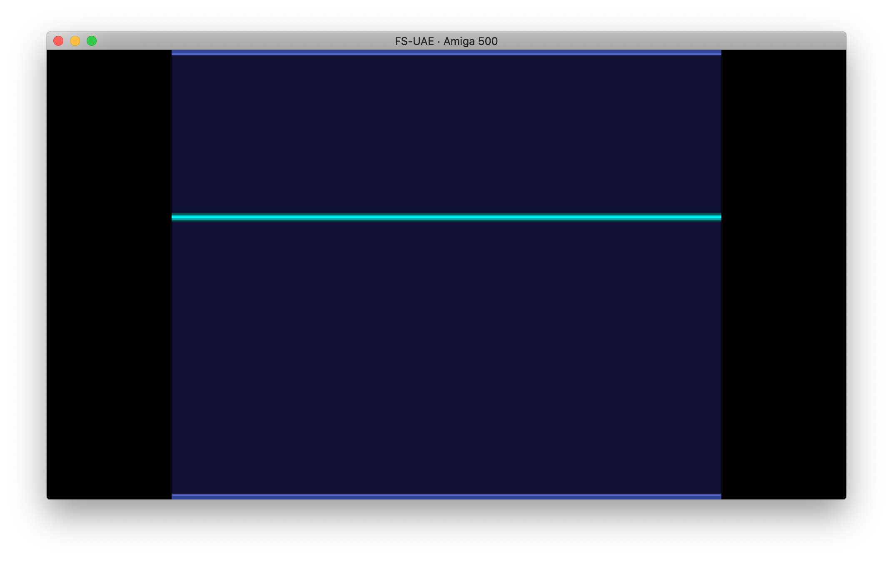

Work in progress, trying to understand these examples & guides:

- <https://www.reaktor.com/blog/crash-course-to-amiga-assembly-programming/>
- <http://vikke.net/index.php?id=copperbars-1>
- <http://coppershade.org/>
- <https://www.youtube.com/watch?v=p83QUZ1-P10&list=PLc3ltHgmiidpK-s0eP5hTKJnjdTHz0_bW>
- [Amiga Hardware Reference Manual](http://amigadev.elowar.com/read/ADCD_2.1/Hardware_Manual_guide/node0000.html)

At the moment, the code in `src/learning.asm` displays a moving horizontal copper bar using a copper list:

## Building

To build the programs, I use [vasm](http://sun.hasenbraten.de/vasm/) to build the binaries in the `hd` dir, see Makefile for info.

## Running

To run the programs, I use the [FS-UAE](https://fs-uae.net/) emulator by provinding an 1.3 Kicksart rom & mounting the host's `hd` with default Amiga 500 conf. This minimal setup should boot on a bare Amiga cli where you can type the name of your generated executable to run it from the mounted hard drive.

Note: booting on an almost empty hardrive opens a cli with no commands at all (no `cd `, no `dir`...). If you need commands in your Amiga cli, you might consider adding a conf that boots on a Workbench floppy (slow), or even better a Workbench hard drive.

## Configuration

See the FS-UAE config file, I'm using an Amiga 500 configuration with a 1.3 Kickstart, sometimes booting with an additional Workbench 1.35 hard drive.

Note: you need an Amiga Kickstart 1.3 to run all this, and if you want to boot the Workbench, you'll need a corresponding floppy drive or hard drive image (not provided by emulators & available through Amiga Forever).
